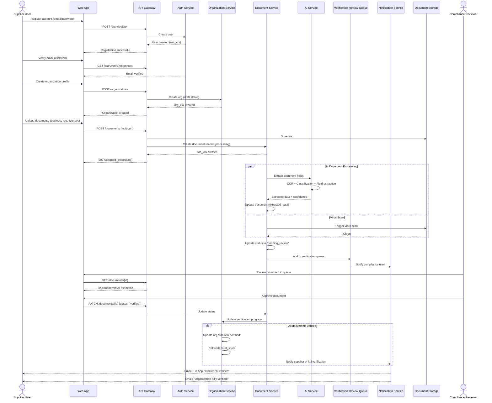
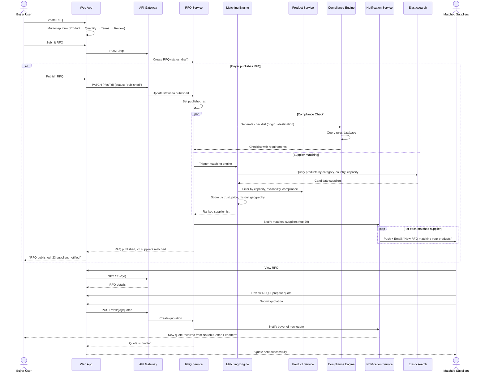
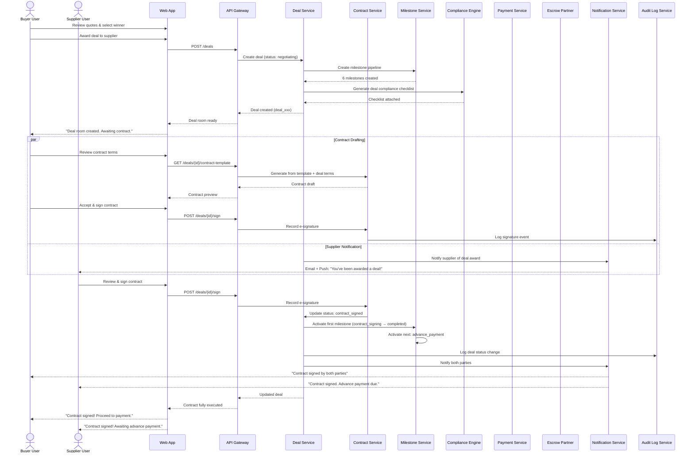
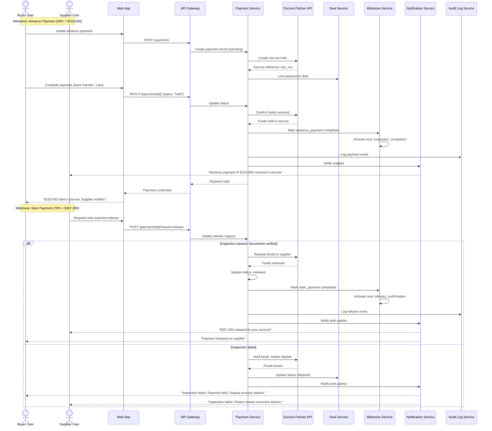
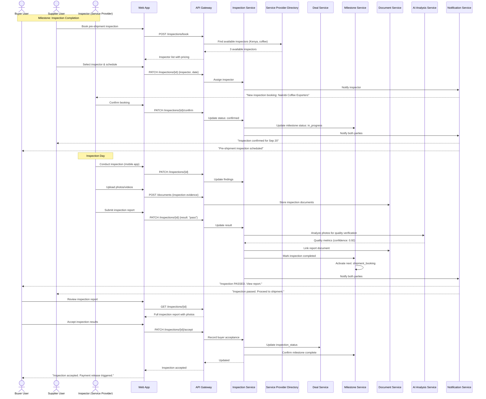
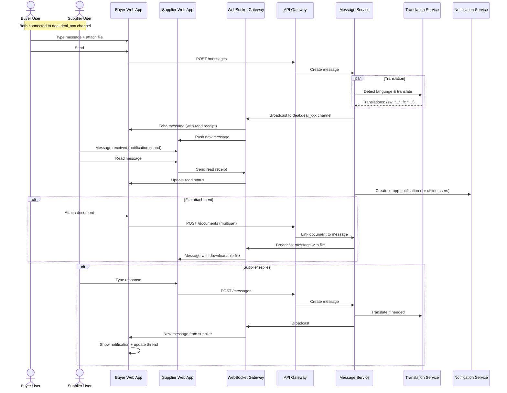
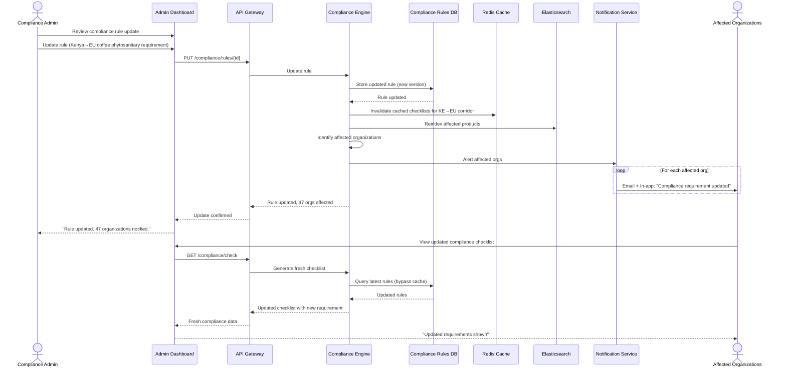
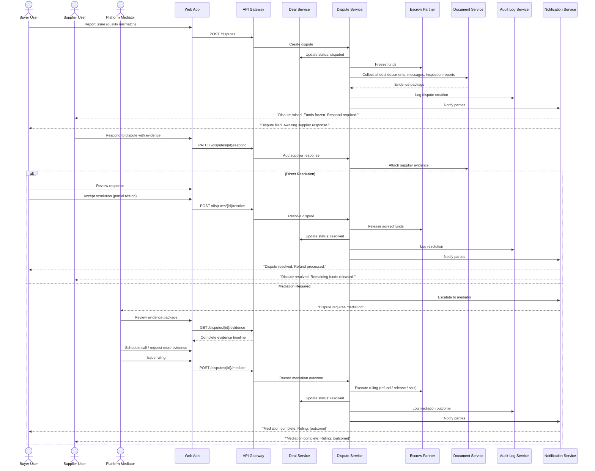
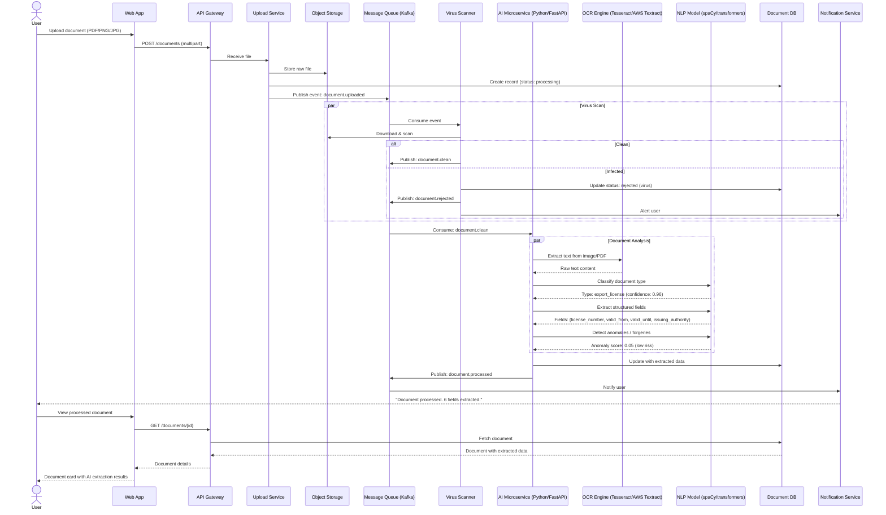

# AATOS — Sequence Diagrams

## 1. Executive Summary

These sequence diagrams define the critical trade workflows in the AATOS platform. Each diagram represents a complete business process from initiation to completion, showing interactions between users, the platform, external services, and partner systems.

## 2. Supplier Onboarding & Verification

## 3. Buyer Publishes RFQ & Supplier Matching

## 4. Deal Creation & Contract Signing

## 5. Payment via Escrow

## 6. Inspection Workflow

## 7. Real-time Messaging in Deal Room

## 8. Compliance Rule Update & Propagation

## 9. Dispute Resolution Workflow

## 10. AI Document Processing Pipeline

---

*AATOS Sequence Diagrams v1.0 | For Engineering & Product Teams*
